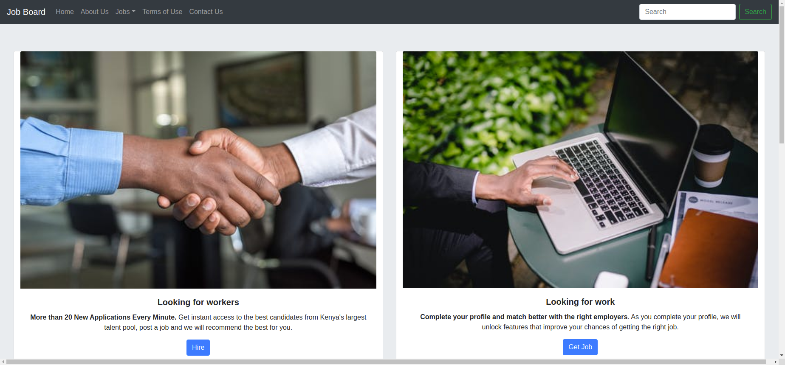

# Job Board
 

Is a web app that allows for users to get services from professionals.

## Screenshot

## Figma link
Here is a link to our [FIGMA](https://www.figma.com/file/HcwTFunvaAjzK7L3glJyBp/Job-Board?node-id=1%3A34).

## More about Job Board

**Job Board** goal is to solve the fundamental employment challenge in Kenya which cuts across
employer-employee quality and discovery. From internship coaching, career counselling, training to personalized
job discovery, we are everything to the candidate. We made checking newspapers obsolete while going a step further
to prepare candidates for the open jobs and workplace. **Job Board** is a career company leveraging technology
to solve human resources and education needs in Kenya; hence, increasing profitability from both personal and
corporate perspectives.

## Technoloies

* HTML5
* CSS
* JavaScript

## Authors

**Danny Wamuya**  
**Clifford Ochieng Odondo**  
**Rustique Uwimpaye**  
**Bratipah Kioko Hammy**  
**Agnes Muturi**  
**Brain Weloba**

## Copyright And License
MIT License  
Copyright © 2020|Job Board
